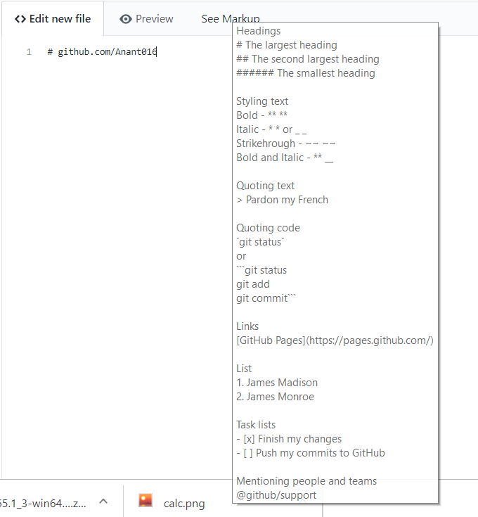

:smiley:
# Github Readme Markdown
## at an instant

I've uploaded a chrome extension specially for Github users to easily write their most important part - "The Documentation", very easily, without searching for markdown at other pages.

# Get it directly from [chrome web Store](https://chrome.google.com/webstore/detail/github-readme-markdown/paacehodnnofnmhogoclomamladkpabg?hl=en&authuser=0)

 

# How to Install

1. Open chrome://extensions/ in chrome browser.
2. Drag-and-drop the .crx file on the above page in Google-Chrome.

:smiley:
Or
### Get it directly from [chrome web Store](https://chrome.google.com/webstore/detail/github-readme-markdown/paacehodnnofnmhogoclomamladkpabg?hl=en&authuser=0)

[Create your own chrome extension — and deploy to Chrome Web Store](https://medium.com/coolanant999/create-your-own-chrome-extension-and-deploy-to-chrome-web-store-66685bc18b8)

### or [Paypal.me](https://www.paypal.me/ARungta)
